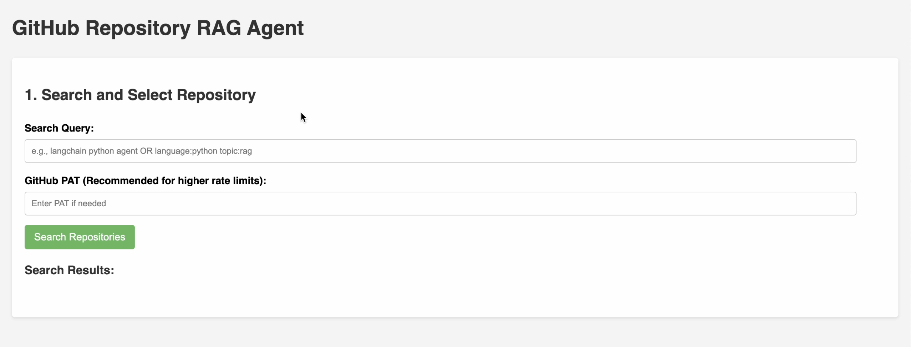
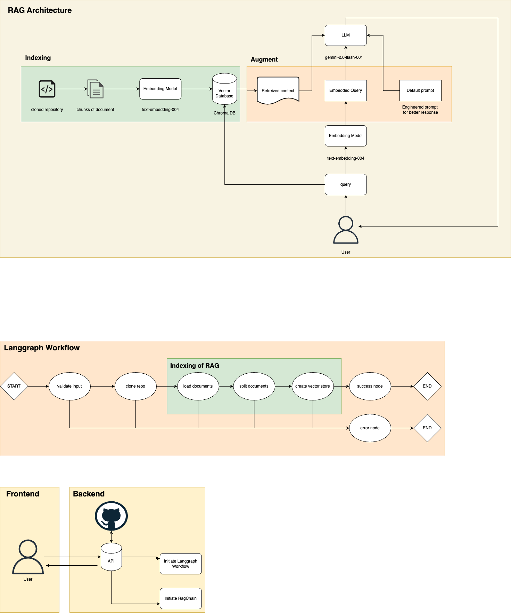

   

# Searching Github Repositories & Asking Questions

## Overview
This project allows you to search through Github repositories and ask questions about them. 
Include any keywords or qualifiers you want to search for, and the app will return relevant results.

## Setup Instructions
1. Set up the backend:
   - Install dependencies: `pip install -r requirements.txt`
   - Copy `.env.example` to `.env` and fill in your credentials. (Github PAT, Google Cloud Vertex AI Project ID, etc.)
   - Choose your preferred LLM model and text embedding model.
   - Run the FastAPI app: `uvicorn app.main:app --reload`
   - Access the API at `http://localhost:8000/docs`

2. Set up the frontend:
    - Open `index.html` in a web browser. (Avoid using `file://` protocol due to CORS issues, use a local server instead)
    - Include the local port and host in `backend/main.py` to allow CORS.
    - Use the form to input your query github repo. (only supports public repos)
    - Click "Submit" to send the request to the backend.
    - When the repo is done being processed, feel free to ask questions about the repo.

# Architecture Diagram

